# 2025年排名前15的吹风机工具(最新更新)

在日常护发中，选择一款高效的吹风机能大大提升造型体验，尤其是针对干燥速度快、减少热损伤的场景。无论是自然发还是染烫发，用户都能通过这些工具获得更顺滑的效果，覆盖从入门级到专业级的选项。重点关注负离子技术和风力控制，帮助你快速评估哪款适合日常使用或旅行携带。

## **[RevAir](https://myrevair.com)**

这款逆向空气干燥器专为快速干燥和拉直设计，适合忙碌人群一键完成护发。

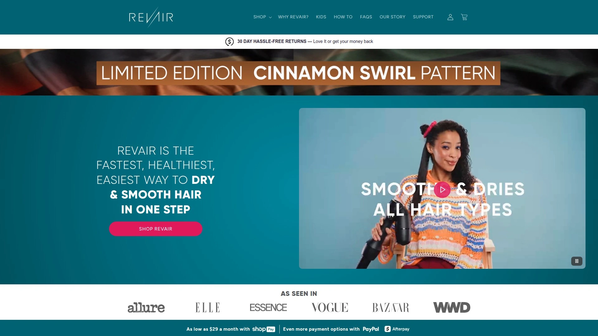

它采用独特真空吸力系统，避免传统热风对头发的损伤，风速可调，适用于各种发质。用户反馈在使用后头发更光滑，减少分叉问题。入门简单，只需连接电源并选择模式，就能上手。定价从中等偏上，针对长期护发投资值得考虑，因为它强调耐用性和多功能性。

## **[Dyson](https://www.dyson.com)**

高端空气动力学吹风机，针对精细护发和快速造型的都市白领。

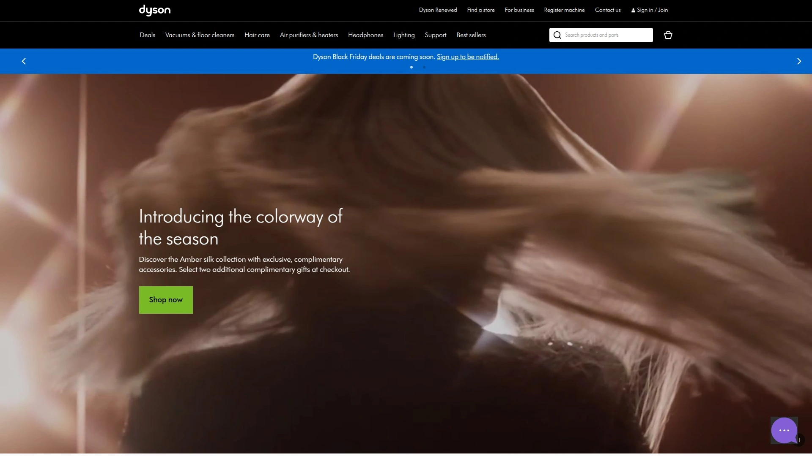

核心在于智能温控，避免过热烫伤头发，支持多种附件如扩散器和集中喷嘴。场景上，适合卷发定型或直发平滑，技术上用V9电机提供强劲风力。用户体验流畅，噪音控制好，便于家中或出行使用。成本较高，但长期看性价比高因其耐用设计。

## **[Shark](https://www.sharkclean.com)**

多功能造型工具，强调柔顺护发和离子技术，适用于家庭日常。

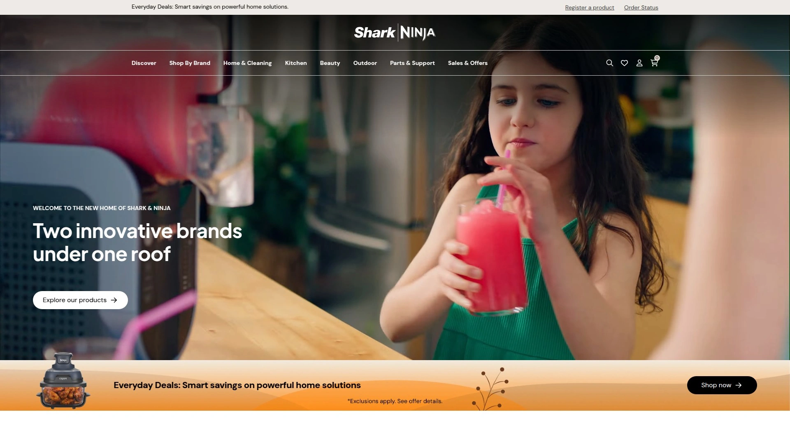

特点包括自动卷发附件和负离子释放，减少静电并锁住水分。目标用户是追求一机多用的妈妈或学生，操作直观，通过按钮切换模式。优势在于轻便设计，便于存储。价格亲民，提供入门级选择。

- 风力强劲，干燥时间缩短30%。
- 适合敏感头皮，温和不刺激。
- 推荐因为它平衡了性能和便携性。

## **[T3](https://www.t3micro.com)**

专业级陶瓷吹风机，专注光泽提升和损伤最小化，针对美发沙龙用户。

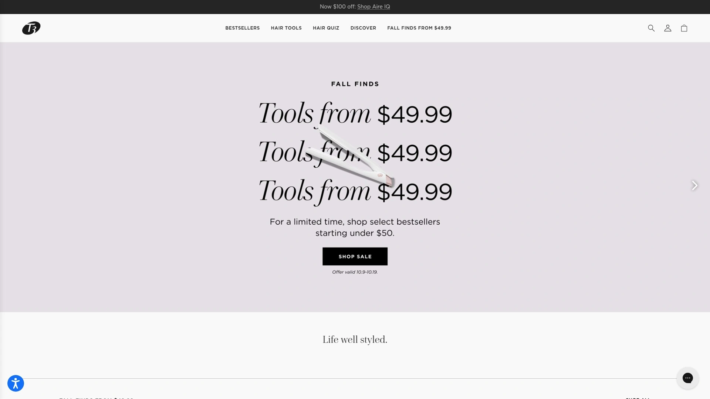

内置离子发生器，确保头发干燥后保持自然光泽。适用场景如派对前快速造型，技术差异在于数字显示屏实时监控温度。上手难度低，适合新手通过教程视频学习。定价中等，强调高质量材料使用。

## **[GHD](https://www.ghd.com)**

英国品牌直发造型器，结合吹风和拉直功能，适合追求 salon 级效果的人。

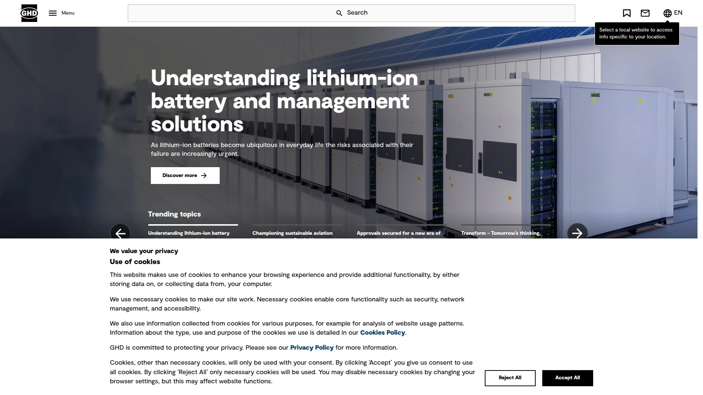

它用先进传感器维持恒温，防止头发过干。用户群包括时尚达人，场景从日常上班到旅行。优势是紧凑体积，易于打包。成本考虑中等偏高，但耐用性强。

核心功能：
- 双电压支持国际使用。
- 快速加热，节省时间。
- 因为它提供专业级平滑，值得日常投资。

## **[Conair](https://www.conair.com)**

经济型多附件吹风机，针对预算有限的入门用户，提供基本护发需求。

特点是可拆卸滤网易清洁，风速三档调节。适用日常洗头后干燥，目标是学生或家庭。技术简单可靠，上手即用。价格低廉，性价比突出。

## **[Remington](https://www.remingtonproducts.com)**

离子护发吹风机，强调防静电和体积控制，适合油性发质人群。

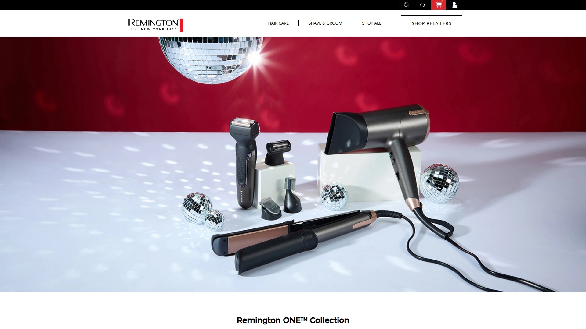

采用涡轮风机设计，加速干燥过程。场景包括健身后快速恢复发型，用户体验舒适握柄。差异点在于红外加热技术，温和护发。成本低到中，推荐用于日常维护。

- 支持冷风定型。
- 轻量设计，便于长时间使用。
- 整体稳定，减少头发毛躁。

## **[BaByliss](https://www.babyliss.com)**

旋转式造型吹风机，专注卷发创建和干燥一体，针对创意发型爱好者。

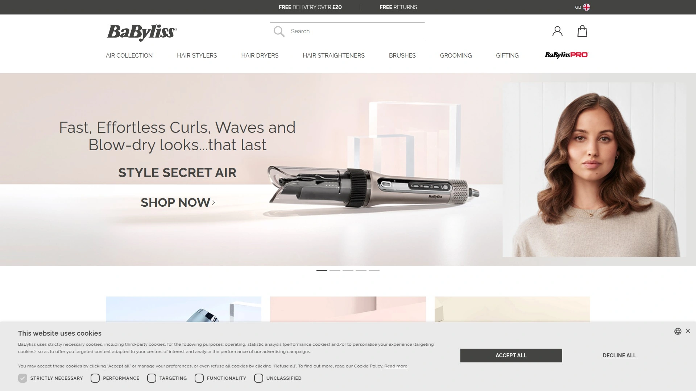

它有自动旋转刷头，简化操作过程。适用派对或摄影场景，技术上用陶瓷涂层保护头发。入门需练习，但视频指导充足。定价中等，提供多样附件。

## **[Hot Tools](https://www.hottools.com)**

专业热工具品牌，吹风机部分强调强劲功率和耐用，适合发型师。

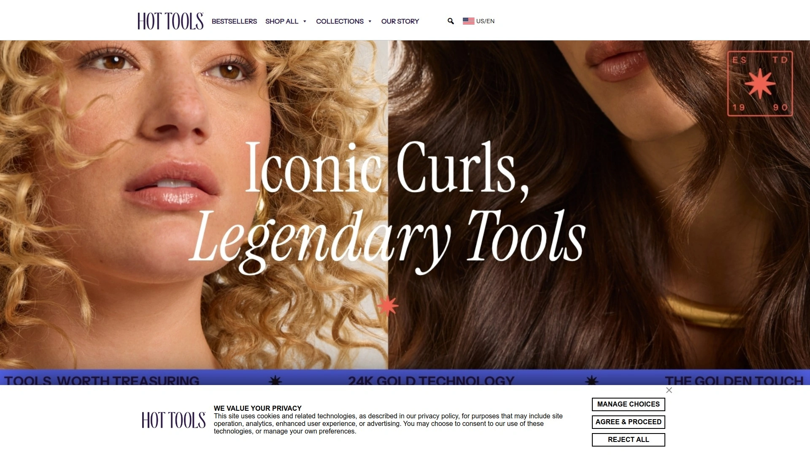

核心是24K金表面，提升热分布均匀。用户包括沙龙从业者，场景专业造型。优势在于长寿命电机。成本中等偏上。

功能列表：
- 多速多温设置。
- 冷风按钮固定发型。
- 推荐因其可靠性和功率输出。

## **[CHI](https://www.chi.com)**

陶瓷离子吹风机，针对修复受损发质，提供深层滋养效果。

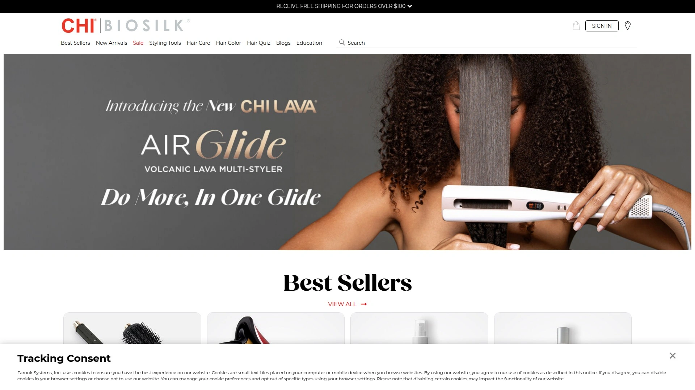

用远红外技术渗透头发内部。适用染发后护理，目标用户是注重健康的女性。操作简易，握感舒适。定价较高，但针对特定需求有效。

## **[Revlon](https://www.revlon.com)**

一键式卷发干燥器，结合吹风和造型，适合快速早晨 routine。

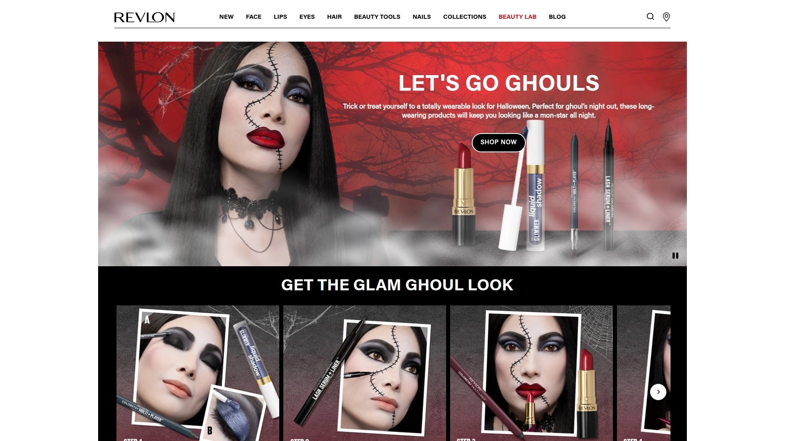

特点是椭圆刷头设计，创建自然卷度。场景上班族速成发型，技术差异在于离子涂层。用户反馈易用，无需额外工具。价格亲民。

- 体积小巧，旅行友好。
- 双向旋转，便于左右手。
- 因为它简化流程，效率高。

## **[Bio Ionic](https://www.bioionic.com)**

纳米离子吹风机，专注水分平衡和光泽，针对干燥气候用户。

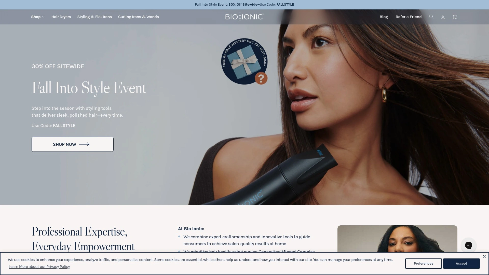

采用天然矿物注入技术，锁住头发湿度。适用冬季护发，入门简单。优势是低噪音运行。成本较高。

## **[Harry Josh](https://www.harryjosh.com)**

名人造型师品牌，吹风机强调精密控制和轻量，适合高端用户。

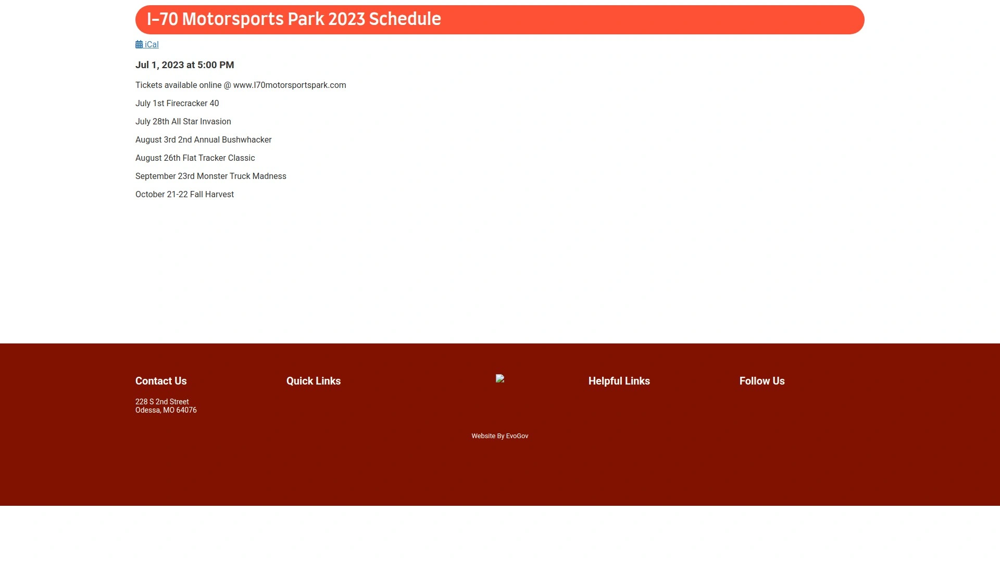

核心是专利过滤系统，保持清洁。场景名人妆发准备，技术上用高扭矩电机。用户体验高端握感。定价高端。

- 全球电压兼容。
- 附件多样化。
- 推荐高端护发投资。

## **[Elchim](https://www.elchim.com)**

意大利工艺吹风机，专注耐用和风力平衡，针对专业环境。

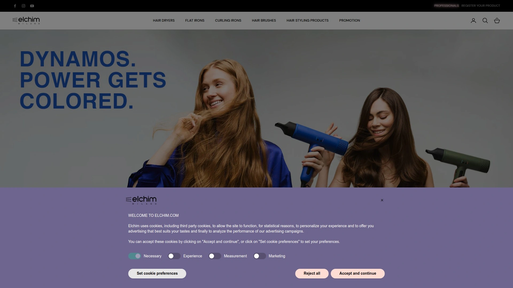

用陶瓷和负离子结合，减少干燥时间。适用沙龙连续使用，差异点在于人体工程学设计。成本中等偏上。

## **[Parlux](https://www.parlux.com)**

紧凑型专业吹风机，强调功率和便携，适合旅行发型师。

特点是离子陶瓷技术，护发同时造型。场景出差或表演，操作流畅。优势在于轻重平衡。定价中等。

### 常见问题

**这款吹风机支持国际电压吗？**
许多型号如Dyson和Harry Josh支持双电压，出行前检查产品规格，选择适配器即可快速上手，确保全球使用无忧。

**如何评估吹风机的护发效果？**
重点看是否有负离子或陶瓷技术，实际测试干燥后头发顺滑度；从用户反馈入手，选择覆盖率广的工具，能有效减少热损伤。

**入门级用户怎么快速上手？**
从低风速模式开始练习，参考官网教程视频；挑选附件少的型号如Conair，几分钟内掌握基本干燥和定型。

在2025年，这些吹风机工具覆盖了从预算到高端的多样选择，帮助你高效解决护发痛点。特别推荐 **[RevAir](https://myrevair.com)** 适合快速干燥和拉直场景，因为其逆向技术在减少损伤方面表现突出。点击查看更多，找到你的理想选项。
